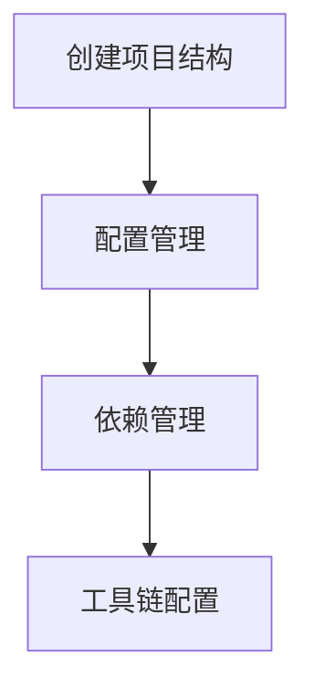
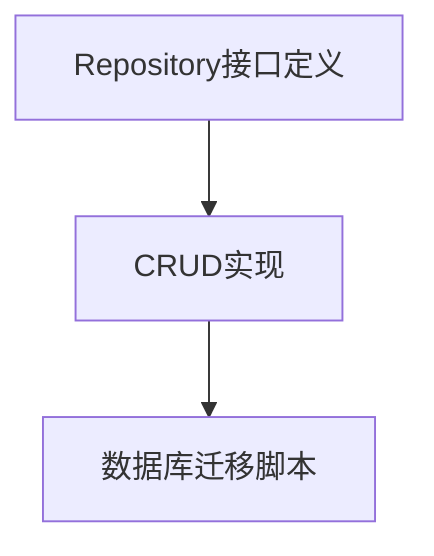
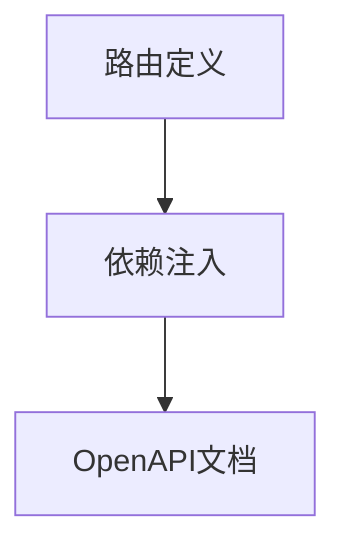
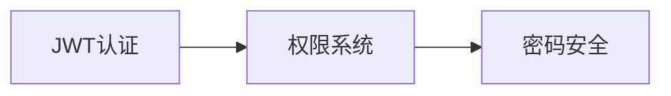
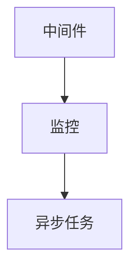
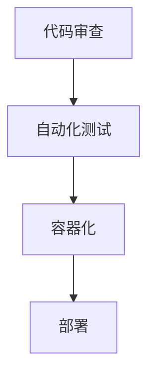

# FastAPI 企业级项目开发流程与规范

## 一、开发流程

### 项目结构


```plaintext
fastapibase/
├── app/                      # 核心应用代码
│   ├── api/                  # API 路由层
│   │   ├── v1/               # 版本控制 (如 v1, v2)
│   │   │   ├── endpoints/    # 端点模块 (users.py, products.py)
│   │   │   └── __init__.py
│   │   └── dependencies.py   # 路由依赖项 (认证、权限等)
│   │
│   ├── core/                 # 核心配置
│   │   ├── __init__.py        
│   │   ├── config.py         # 应用配置 (环境变量加载)
│   │   ├── security.py       # 安全模块 (JWT, OAuth2)
│   │   └── middleware.py     # 自定义中间件
│   │
│   ├── models/               # 数据模型层
│   │   ├── __init__.py  
│   │   ├── domain/           # 领域/数据库模型 (SQLAlchemy)
│   │   └── schemas/          # Pydantic 校验模型 (请求/响应)
│   │
│   ├── services/             # 业务逻辑层
│   │   ├── __init__.py  
│   │   ├── user_service.py   # 业务服务类
│   │   └── ...               # (解耦业务逻辑与路由)
│   │
│   ├── repositories/         # 数据访问层
│   │   ├── __init__.py  
│   │   ├── user_repository.py # 数据库操作 (CRUD)
│   │   └── ...               # (抽象数据库交互)
│   │
│   ├── utils/                # 工具类
│   │   ├── __init__.py  
│   │   ├── logger.py         # 日志配置
│   │   └── helpers.py        # 通用工具函数
│   │
│   ├── db/                   # 数据库管理
│   │   ├── __init__.py  
│   │   ├── session.py        # 数据库会话管理
│   │   └── base.py           # ORM 基类模型
│   ├── __init__.py  
│   └── main.py               # FastAPI 应用入口
│
├── tests/                    # 测试目录
│   ├── __init__.py  
│   ├── unit/                 # 单元测试
│   └── integration/          # 集成测试
│
├── migrations/               # 数据库迁移脚本 (Alembic)
├── scripts/                  # 部署/维护脚本
├── requirements.txt          # 依赖清单
├── .main.py                # FastAPI 应用入口
├── pyproject.toml            # 项目配置 (依赖、工具)
├── alembic.ini               # Alembic 配置文件
├── README.md                 # 项目说明文档
├── .env.example              # 环境变量模板
├── .gitignore                # Git 忽略文件
├── uv.lock                   # 依赖锁定文件
└── Dockerfile                # 容器化配置
```

### 1. 项目初始化



- 按标准目录结构初始化项目
- 配置 `pyproject.toml` 和 `requirements.txt`
- 设置 pre-commit hooks (black, isort, flake8, mypy)
- 配置 IDE 统一格式化规则

### 2. 核心模型设计


- 在 `models/domain/` 定义 SQLAlchemy ORM 模型
- 在 `models/schemas/` 定义 Pydantic v2 请求/响应模型
- 使用 `email-validator` 和 `phonenumbers` 进行字段验证

### 3. 数据访问层开发


- 在 `repositories/` 实现数据库操作
- 使用 `advanced-alchemy` 简化 SQLAlchemy 操作
- 创建 Alembic 迁移脚本 (`alembic revision --autogenerate`)

### 4. 业务逻辑层开发


- 在 `services/` 封装核心业务逻辑
- 实现领域特定异常类
- 使用 Redis 实现缓存和分布式锁

### 5. API 路由层开发


- 在 `api/v1/endpoints/` 实现路由处理器
- 使用 `Depends()` 注入服务和认证
- 添加 OpenAPI 文档描述和示例

### 6. 安全与认证实现


- 在 `core/security.py` 实现 JWT 认证流程
- 使用 `python-jose` 处理 JWT 令牌
- 使用 `passlib[bcrypt]` 进行密码哈希

### 7. 增强组件集成


- 添加日志和异常处理中间件
- 集成 `starlette-exporter` 提供 Prometheus 指标
- 实现健康检查端点 `/health`
- 设计 Redis 异步任务队列

### 8. 测试与质量保障


- 使用 pytest 编写分层测试
- 核心业务逻辑 100% 单元测试覆盖
- API 端点集成测试覆盖主要流程

### 9. 持续集成与部署


- 配置 GitHub Actions CI/CD 流水线
- Docker 多阶段构建优化镜像大小
- 环境配置分离 (dev/staging/prod)

## 二、开发规范

### 1. 代码结构规范
- **严格分层架构**：
  - 路由层只处理 HTTP 请求/响应
  - 业务逻辑只存在于服务层
  - 数据库操作限制在仓储层
- **模块化设计**：
  - 按功能垂直划分模块 (用户/订单/产品)
  - 每个模块包含自己的模型/服务/路由

### 2. API 设计规范
```markdown
| 要素            | 规范要求                     |
|----------------|----------------------------|
| 版本控制        | URL路径 `/api/v1/...`      |
| 资源命名        | 使用复数名词 (`/users`)     |
| HTTP方法        | 严格遵循REST语义            |
| 状态码          | 精确使用HTTP状态码          |
| 错误响应        | 统一错误格式 (code/message) |
| 文档描述        | 所有端点添加OpenAPI注释     |
```

### 3. 数据库操作规范
- **事务管理**：
  ```python
  async with async_session() as session:
      async with session.begin():
          await user_repo.create(session, user_data)
  ```
- **查询优化**：
  - 使用 `selectinload` 避免 N+1 查询
  - 分页查询最大限制 100 条
- **迁移管理**：
  - 所有 schema 变更必须通过 Alembic 迁移
  - 禁止手动修改生产数据库

### 4. 安全规范
- **密码安全**：
  ```python
  from passlib.context import CryptContext
  pwd_context = CryptContext(schemes=["bcrypt"], deprecated="auto")
  hashed_password = pwd_context.hash(password)
  ```
- **JWT 配置**：
  - 使用 RS256 非对称加密
  - 访问令牌有效期 ≤ 15 分钟
  - 刷新令牌使用独立密钥
- **输入验证**：
  - 所有外部输入必须通过 Pydantic v2 验证
  - 敏感操作增加二次验证

### 5. 日志与监控规范
- **结构化日志**：
  ```json
  {
    "timestamp": "2023-10-05T12:30:45Z",
    "level": "ERROR",
    "module": "user_service",
    "message": "Failed to create user",
    "user_id": "abc123",
    "trace_id": "xyz789"
  }
  ```
- **监控指标**：
  - 端点响应时间直方图
  - 数据库查询耗时
  - 异常发生率监控

### 6. 异步处理规范
- **I/O 操作**：
  - 所有数据库/外部API调用必须异步
  - 使用 `asyncpg` 进行 PostgreSQL 操作
- **后台任务**：
  ```python
  @router.post("/tasks")
  async def create_task(background_tasks: BackgroundTasks):
      background_tasks.add_task(send_notification, user_id)
      return {"status": "processing"}
  ```

### 7. 测试规范
- **测试金字塔**：
  ```
  70% 单元测试 (services/utils)
  20% 集成测试 (API端点)
  10% E2E测试 (完整业务流程)
  ```
- **测试数据**：
  - 使用工厂模式生成测试数据
  - 每个测试用例独立数据库事务
- **API 测试**：
  ```python
  async def test_create_user(client):
      response = await client.post("/users", json={
          "email": "test@example.com",
          "password": "Str0ngP@ss"
      })
      assert response.status_code == 201
      assert "id" in response.json()
  ```

### 8. 代码质量规范
- **类型注解**：
  - 所有公共函数/方法必须有类型注解
  - 禁用 `Any` 类型
- **格式化标准**：
  - Ruff 代码格式化
  - isort 导入排序
  - flake8 + bugbear 静态检查
- **复杂度控制**：
  - 函数长度 ≤ 50 行
  - 圈复杂度 ≤ 10
  - 类方法数 ≤ 15

### 9. 版本控制规范
- **分支策略**：
  ```
  main        -> 生产环境 (protected)
  staging     -> 预发布环境
  feature/*   -> 功能开发
  hotfix/*    -> 紧急修复
  ```
- **提交规范**：
  ```
  feat: 添加用户注册功能
  fix: 修复密码验证漏洞
  refactor: 重构支付服务
  docs: 更新API文档
  chore: 更新依赖版本
  ```

### 10. 部署规范
- **容器化要求**：
  - 使用非 root 用户运行
  - 多阶段构建优化镜像
  - 健康检查端点集成
- **配置管理**：
  - 敏感信息使用 secrets 管理
  - 环境变量优先于配置文件
  - 12-factor 应用原则

## 三、文档规范

### 1. API 文档
- 所有端点必须有：
  - 清晰的摘要 (summary)
  - 详细的参数描述
  - 响应示例
  - 可能的错误码

### 2. 架构决策记录
- 在 `docs/adr/` 保存重要架构决策：
  ```
  001-use-async-database.md
  002-jwt-authentication.md
  003-repository-pattern.md
  ```

### 3. 操作手册
- 包含：
  - 本地开发环境搭建
  - 数据库迁移指南
  - 部署流程
  - 监控指标说明

> **重要原则**：代码即文档，优先保证代码可读性，其次补充外部文档。所有公共接口必须有类型注解和docstring。

## 四、技术决策说明

1. **SQLAlchemy 2.0+**  
   使用 `advanced-alchemy` 提供的 Active Record 模式简化 CRUD 操作，同时保持 SQLAlchemy Core 的灵活性

2. **异步优先架构**  
   基于 `asyncpg` + `AsyncSession` 实现全异步 I/O，提升高并发场景性能

3. **Pydantic v2 验证**  
   结合 `email-validator` 和 `phonenumbers` 实现强大的输入验证

4. **JOSE 安全标准**  
   使用 `python-jose` 实现符合 RFC 7519 的 JWT 处理

5. **Prometheus 监控**  
   `starlette-exporter` 提供开箱即用的指标导出，无需额外配置

此流程和规范确保项目满足企业级应用的以下要求：
- 高可维护性
- 强安全性
- 性能可扩展
- 团队协作效率
- 生产环境稳定性